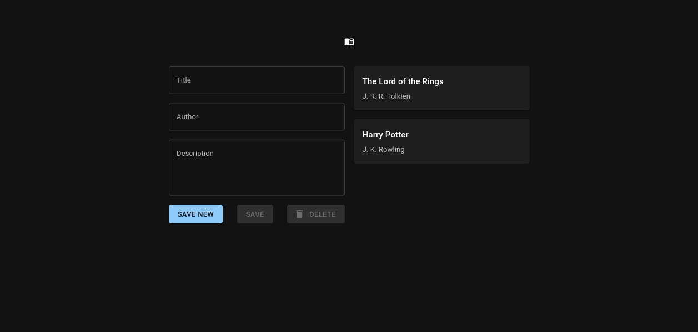

# Library app



## Features

- React frontend
- Nginx web server
- Rust Actix-web backend
- PostgreSQL database

## How to run it?

**Prerequisites:** You must have `docker` and `docker-compose` installed, and the docker daemon running. (https://docs.docker.com/compose/install)

To launch all three containers and start the application, simply type:
```
$ docker-compose up
```
It will take few minutes to compile everything the first time you run it (rust is notoriously slow to compile), but the runtime and subsequent compiles are very fast thanks to caching.

(you might have to run `docker-compose` as root or use `sudo`)

Then navigate your favourite browser to http://localhost:3000
